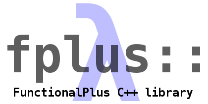

FunctionalPlus
==============
**helps you write concise and readable C++ code.**

Introduction
------------
Great code should mostly be self-documenting, but while using C++ in reality you can find yourself dealing with low-level stuff like iterators or hand-written loops that distract from the actual essence of your code.

**FunctionalPlus is a small header-only library** supporting you in reducing code noise and in dealing with only one single level of abstraction at a time. By increasing brevity and maintainability of your code it can improve productivity (and fun!) in the long run. It pursues these goals by providing pure and easy-to-use functions that free you from implementing commonly used flows of control over and over again.

Say you have a list of numbers and are interested in the odd ones only.
```c++
bool is_odd(int x) { return x % 2 == 1; }
int main()
{
    typedef vector<int> Ints;
    Ints numbers = { 24, 11, 65, 44, 80, 18, 73, 90, 69, 18 };
    // todo: get odd values from numbers ...
}
```

There are different possibilities to obtain your goal. Some of them are:

1. write a (range based) for loop
 ```c++
     Ints odds;
     for (int x : numbers)
     {
         if (is_odd(x))
         {
             odds.push_back(x);
         }
     }
 ```

2. use `std::copy_if` from the STL
 ```c++
     Ints odds;
     std::copy_if(std::begin(numbers), std::end(numbers),
             std::back_inserter(odds), is_odd);
 ```

3. use `keep_if` from `FunctionalPlus`
 ```c++
     auto odds = fplus::keep_if(is_odd, numbers);
 ```

If you think version 3 could be the one most pleasant to work with, you might like FunctionalPlus.
And if you still think the hand-written for loop is easier to understand, also consider what would happen if the loop body (i.e. a corresponding lambda function in the call to `fplus::keep_if`) would be much longer. When reading `keep_if` you would still immediately know that `odds` can only contain elements that came from `numbers` and were selected by some, possibly complicated, predicate. In the for loop case you have no idea what is happening until you read the whole loop body. The loop version probably would need a comment at the top stating what the use of `keep_if` would tell at first glance.


More examples
-------------
Below you find some short examples showing nice things you can do with functions and containers using FunctionalPlus.

### The same old song
You can test the content of a container for various properties, e.g.
```c++
#include "fplus.h"
#include <iostream>
int main()
{
    std::list<std::string> things = {"same old", "same old"};
    if (fplus::all_the_same(things))
        std::cout << "All things being equal." << std::endl;
}
```

### The I in our team
There also are some convenience functions for retrieving properties of containers. For example you can count the occurrences of a character in a string.
```c++
#include "fplus.h"
#include <iostream>
int main()
{
    std::string team = "Our team is great. I love everybody I work with.";
    std::cout << "There actually are this many 'I's in team: " <<
        fplus::count("I", fplus::split_words(team, false)) << std::endl;
}
```

Output:

```
There actually are this many 'I's in team: 2
```

### The cutest kitty
Finding the highest rated element in a container is very simple compared to [a hand-written version](https://gist.github.com/Dobiasd/a4e7aa9c25a3dd4c0522d75a71e2a867#file-cuteness-cpp-L28-L38).
```c++
#include "fplus.h"
#include <iostream>

struct cat
{
    std::string name_;
    double softness_;
    double temperature_;
    double size_;
    double roundness_;
    double fur_amount_;
};

int main()
{
    auto cuteness = [](const cat& c) -> double
    {
        return c.softness_ * c.temperature_ * c.roundness_ *
            c.fur_amount_ - c.size_;
    };
    std::vector<cat> cats = {
        {"Tigger",   5, 5, 5, 5, 5},
        {"Simba",    2, 9, 9, 2, 7},
        {"Muffin",   9, 4, 2, 8, 6},
        {"Garfield", 6, 5, 7, 9, 5}};

    auto cutest_cat = fplus::maximum_on(cuteness, cats);

    std::cout << cutest_cat.name_ <<
        " is happy and sleepy. *purr* *purr* *purr*" << std::endl;
}
```

Output:

```
Muffin is happy and sleepy. *purr* *purr* *purr*
```

### Transformations, function composition and binding
Let's say you have the following function [given](https://gist.github.com/Dobiasd/77587769cbc0e13ed582).
```c++
std::list<std::uint64_t> collatz_seq(std::uint64_t x);
```

And you want to create an `std::map<std::uint64_t, std::string>` containing string representations of the [Collatz sequences](https://en.wikipedia.org/wiki/Collatz_conjecture) for all numbers below 30. You can implement this nicely in a functional way too.

```c++
#include "fplus.h"
#include <iostream>

// std::list<std::uint64_t> collatz_seq(std::uint64_t x) { ... }

int main()
{
    typedef std::list<uint64_t> Ints;

    // [1, 2, 3 ... 29]
    auto numbers = fplus::generate_range<Ints>(1, 30);

    // A function that does [1, 2, 3, 4, 5] -> "[1 => 2 => 3 => 4 => 5]"
    auto show_ints = fplus::bind_1st_of_2(fplus::show_cont_with<Ints>, " => ");

    // A composed function that calculates a Collatz sequence and shows it.
    auto show_collats_seq = fplus::compose(collatz_seq, show_ints);

    // Apply it to all our numbers.
    auto seq_strs = fplus::transform(show_collats_seq, numbers);

    // Combine the numbers and their sequence representations into a map.
    auto collatz_dict = fplus::create_map(numbers, seq_strs);

    // Print some of the sequences.
    std::cout << collatz_dict[13] << std::endl;
    std::cout << collatz_dict[17] << std::endl;
}
```

Output:

```
[13 => 40 => 20 => 10 => 5 => 16 => 8 => 4 => 2 => 1]
[17 => 52 => 26 => 13 => 40 => 20 => 10 => 5 => 16 => 8 => 4 => 2 => 1]
```

The functions shown not only work with default STL containers like `std::vector`, `std::list`, `std::deque`, `std::string` etc., but also with custom containers providing a similar interface.


Type deduction and useful errors messages
-----------------------------------------
FunctionalPlus deduces types for you where possible. Let's take one line of code from the Collatz example:
```c++
    auto show_collats_seq = fplus::compose(collatz_seq, show_ints);
```

`collatz_seq` is a function taking an `uint64_t` and returning a `list<uint64_t>`. `show_ints` takes a `list<uint64_t>` and returns a `string`. Thanks to making use of `function_traits` [written by kennyim](https://github.com/kennytm/utils/blob/master/traits.hpp) it is possible to automatically deduce the expression `fplus::compose(collatz_seq, show_ints)` being a function taking an `uint64_t` and returning a `string`, so you do not have to manually provide type hints to the compiler.

In case you would accidentally pass two functions whose "connecting type" does not match, you will get a nice error message telling you exactly that, because FunctionalPlus uses compile time assertions where feasible to guard you from the sometimes confusingly long error messages compilers like to generate when faced with type errors in function templates.

By changing the way you think about programming from "writing your own loops and nested ifs" to "using and composing small functions" you will first perhaps get more errors at compile time, but this will pay out in having fewer errors at runtime and in spending less time debugging.


Finding the functions you need
------------------------------
If you are looking for a specific FunctionalPlus function you do not know the name of yet, you can of course use the autocomplete feature of your IDE to browse the content of the namespace `fplus`. But the recommended way is to simply use the **[FunctionalPlus API search website](http://www.editgym.com/fplus-api-search/)**. You can quickly search by keywords or (curried) function type signatures there.


Performance
-----------
The basic functions are fast, thanks to C++'s concept of abstraction without overhead. Here are some measurements from the first example, taken on a standard desktop PC, compiled with GCC and the `O3` flag.
```
5000 random numbers, keep odd ones, 20000 consecutive runs accumulated
----------------------------------------------------------------------

| Hand-written for loop | std::copy_if | fplus::keep_if |
|-----------------------|--------------|----------------|
|               0.632 s |      0.641 s |        0.627 s |
```

So the compiler seems to do a very good job in optimizing and inlining everything to basically equal machine code performance-wise.

The more complex functions though sometimes can be written in a more optimized way. If you use FunctionalPlus in a performance-critical scenario and profiling shows you need a faster version of a function [please let me know](https://github.com/Dobiasd/FunctionalPlus/issues) or [even help improving FunctionalPlus](https://github.com/Dobiasd/FunctionalPlus/pulls).

Additionally keep in mind that FunctionalPlus always produces copies and never operates in place. So it is biased towards developer productivity and readability of code and not towards using as little memory as possible.


Installation/Requirements
-------------------------
Just [download](https://github.com/Dobiasd/FunctionalPlus/archive/master.zip) FunctionalPlus and tell your compile to use the `include` directory.

A **C++11**-compatible compiler is needed. The tests run successfully on GCC 4.9, Clang 3.6 and Visual C++ 2015.

With [cmake](https://cmake.org/) the tests can be run and the library installed following these steps:

```
mkdir build
cd build
# Set cxx flags if they are not already set by the toolchain
CXXFLAGS='-std=c++11' cmake ..
# Build and run the tests
cmake --build . --target check
# Install the library
cmake --build . --target install
```

For MSVC, the `CXXFLAGS='-std=c++11'` setting can be omitted.

It can also be installed directly using [cget](https://github.com/pfultz2/cget/):

```
# Setup up toolchain to use c++11
cget init --std=c++11
# Test and install
cget install Dobiasd/FunctionalPlus
```

Disclaimer
----------
The functionality in this library initially grew due to my personal need for it while using C++ on a regular basis. I try my best to make it error free and as comfortable to use as I can. The API still might change in the future. If you have any suggestions, find errors, miss some functions or want to give general feedback/criticism, I'd [love to hear from you](https://github.com/Dobiasd/FunctionalPlus/issues). Of course, [contributions](https://github.com/Dobiasd/FunctionalPlus/pulls) are also very welcome.


License
-------
Distributed under the Boost Software License, Version 1.0.
(See accompanying file [`LICENSE_1_0.txt`](https://github.com/Dobiasd/FunctionalPlus/blob/master/LICENSE_1_0.txt) or copy at
[http://www.boost.org/LICENSE_1_0.txt](http://www.boost.org/LICENSE_1_0.txt))
